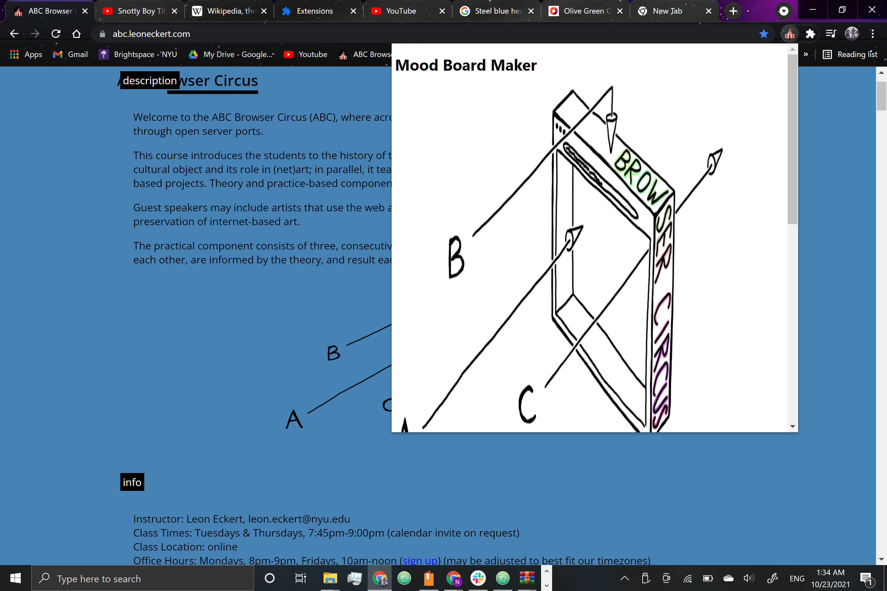

This browser extension was designed for my sister. Because she is an artist and likes to draw digital art, I designed a browser extension that attempts to aid her workflow.

The extension has a pop up window with a button that allows you to grab all images within a webpage. I also changed the background color to a color she likes. I finally used the chrome alarm api to send a posture check notification in the form of a separate window popup every 15 minutes.
