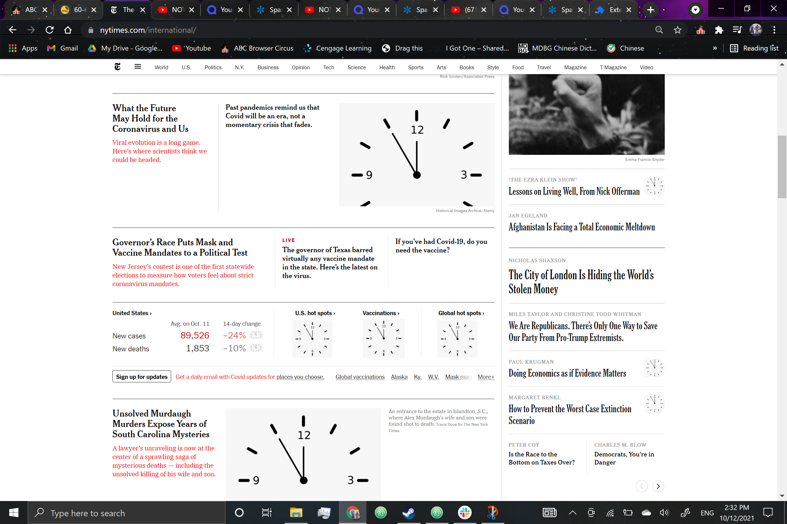
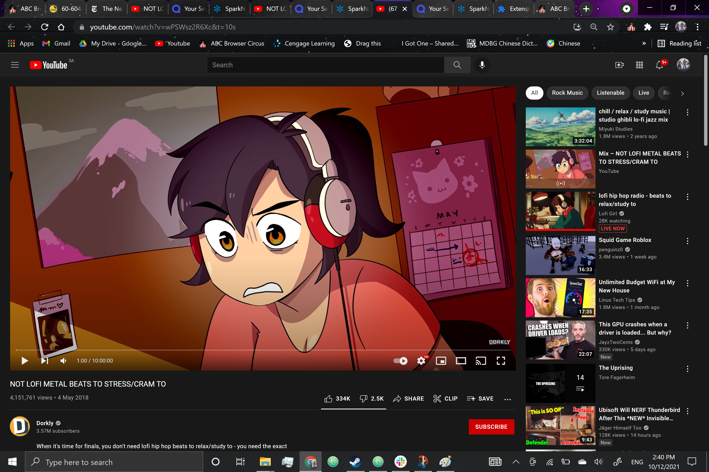

## Description:

This Browser extension is called "study mode" it alters webpages to make any text red and replaces images in a webpage with a clock image. It also opens 3 tabs: quizlet, sparknotes.com and a YouTube video titled: "NOT LOFI METAL BEATS TO STRESS/CRAM TO".

