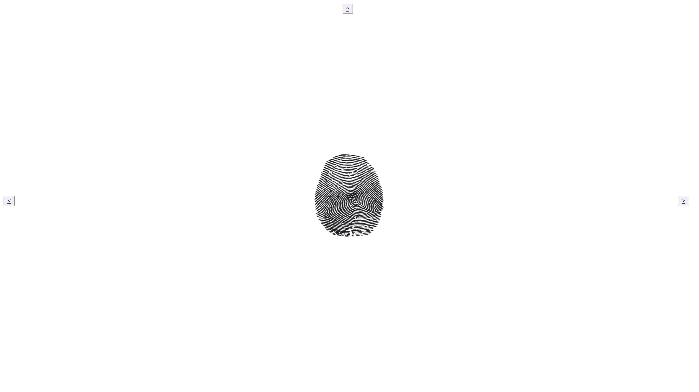

## Description 2:

This project is an abstract and minimalist website that features puzzles for you to solve in each webpage. By solving each puzle the user realizes the amount of information the browser can collect. I used platform.js, Geo location API and pure javascript. This project showcases how browser fingerprinting and other types of fingerprinting can occur in the background without the user realizing it. For example, in one of the puzzles the user is asked to press a button, but by clicking the button the user inadvertenly gives up his location without the browser asking the user to accept or reject that request.

## Challenges & Shortcomings 2:

This project took more time to properly research how to extract info from website visitors than expected; I mostly found enterprise solutions or solutions that require back-end coding. Moreover, I intended to use the geo API with a reverse geo api in order to get a user's country or even province, but I found some trouble in setting up the necessary google APIs, due to time constraints I just used the standard geo location API. Also, due to limited amount of tools and time I decided to cut the 4th puzzle as well.   

## Reflection 2:

In essence, I learned a lot during this project and understood more about browsers and their capabilites, which I underestimated in the past. I am relativily satisfied with the final result, and I eagerly await feedback from my instructor and peers.
