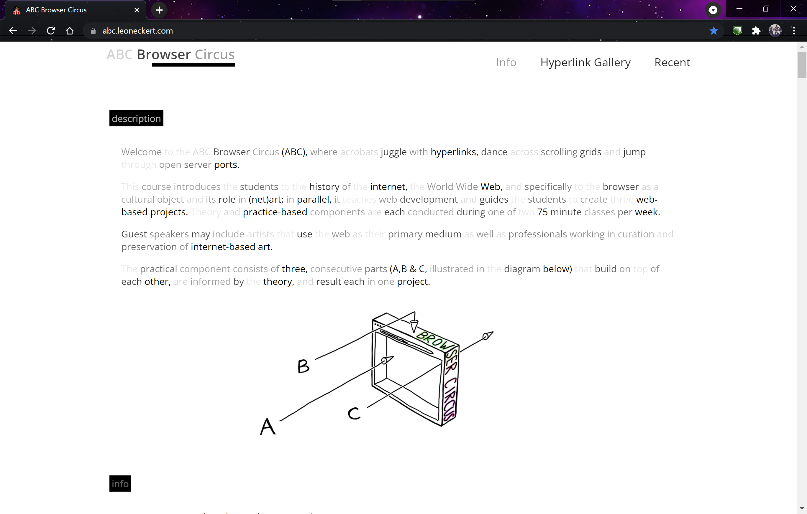

## Description:

Do you want to prank your friends? Or feel guilty everytime you copied someone else's words? By downloading this extension you cna accomplish just that! What this extension does is it slowly but surely fade the text that you see on webpages everytime you copy any text from any website. The more words you copy that begin with the same letter, the more faded they will be. [Download it today!](https://www.google.com)

## How it works:

First the content script grabs any text you copied using the getSelection() method after the "copied" event is triggered. Then, the words get sent to the background script, and then the background script loops over the words to count the occuernece of each letter. Then this information is sent as a dictionary object with the letters as a key and the value as the number of occurence. Finally the content script receives this information, wraps all the text on the webpage in span tags then finally apply an opacity based on the number of occurence of a letter to each word with that letter. 
